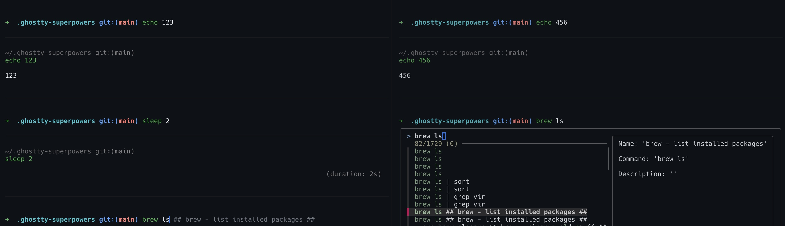

<p align="center"></p>

# Ghostty Terminal with Superpowers! (BETA)

Ghostty Terminal with Zsh, a simple and awesome UI, advanced autocomplete, fzf, command snippets/history, and much more.

## Requirements
- OS requirement: macOS, Ubuntu, or Arch / Arch-based OS. Alternatively, make sure one of the following package managers is available on your system: brew, pacman, snap+apt.
- For all other OSs (skip `./install.sh` and set up manually): install Ghostty, zsh, fzf, and a Hack Nerd Font (e.g. `font-hack-nerd-font`); clone `zsh-autosuggestions` and `zsh-syntax-highlighting` into `plugins_external/`; use `data/ghostty-config` as your Ghostty config; add `source ~/.ghostty-superpowers/init.zsh` to your `~/.zshrc`; then (re)start Ghostty.

## Install
1. Clone the repository
    ```bash
    git clone git@github.com:iocron/ghostty-superpowers.git ~/.ghostty-superpowers
    ```
2. Set up the installer
    ```bash
    cd ~/.ghostty-superpowers && chmod +x install.sh
    ```
3. Start the Installer and pick a profile when prompted:
    ```bash
    ./install.sh
    ```
    - **Minimal** — Ghostty + config, zsh, the zsh plugins, fzf, and the Hack Nerd Font.
    - **Full** — everything in Minimal plus extra tools (btop, fd, helix, lazygit, ripgrep, tldr, …) and the AI stack (Ollama + a default model, pulled for you).
4. (Re)start Ghostty (on macOS located in /Applications/Ghostty.app)

Enjoy your new Ghostty Experience :)

## Features
- Ghostty Terminal
- Ghostty Blockview with Gadgets
- Zsh with a built-in framework (prompt, completion, keybindings, git prompt)
- Prefer oh-my-zsh? Set `GHOSTTY_SUPERPOWERS_USE_OMZ=1` in your ~/.zshrc (before `init.zsh` is sourced) to load your existing oh-my-zsh in place of the built-in framework — the rest of ghostty-superpowers (plugins, fzf, snippets, AI completion) still loads either way
- Advanced Autocomplete (including Snippet-Search)
- Advanced Fzf Reverse-Search (including Snippet-Search)
- Snippet-/Historysearch and Sync (used for autocomplete/reverse-search)
- AI-Powered LLM Completion (type `#` followed by text and press Tab or Enter)
- Directory Jump — numeric shortcuts (`0`-`9`) to hop between your most-used directories (type `0` to show the ranked list)
- Quick browser websearch (e.g. `s <query>`)
- Other helper aliases and functions can be listed with `alias` / `functions`

## How to use the AI Auto-Completion Feature
The **Full** install already sets up Ollama and pulls the default model, so this works out of the box. After a **Minimal** install, install Ollama yourself (https://ollama.com/) and pull a model: `ollama pull gemma4:e2b` (or `gemma4:e2b-mlx` on macOS).

To use a different model, pull it and set `GHOSTTY_SUPERPOWERS_OLLAMA_MODEL` in `~/.ghostty-superpowers/.env` (or your zsh profile), e.g. `GHOSTTY_SUPERPOWERS_OLLAMA_MODEL=gemma4:e2b`.

Then, in a new pane or session, use it two ways — press Tab or Enter after typing:
- **Generate** a command: start the line with `#` and describe what you want, e.g. `# list files by size`.
- **Modify** a command: write the command, then `#` and an instruction, e.g. `echo 123 # change the string to hello world` → `echo "hello world"`.

## How to use the Snippet Feature
Simply create/edit the file ~/.ghostty-superpowers/data/snippets.txt and add snippets in the form:
```text
COMMAND ## NAME/TITLE ## DESCRIPTION..
```

For example: `echo "123" ## Echo example ## Outputs text`

When you restart Ghostty, you should see your new commands in the history/reverse search and while typing (due to autocomplete). If this still doesn't work, delete the file /tmp/.ghostty_snippets_lastrun and restart Ghostty again.

## Preview



